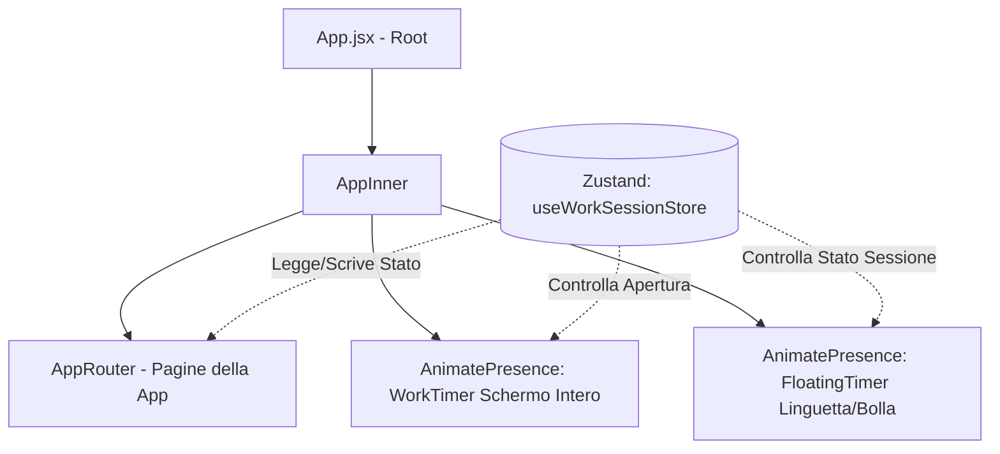

# Documentazione di Progetto: Refactoring Sessione di Lavoro e Timer Minimizzabile

Questa documentazione descrive le specifiche di design, l'esperienza utente (UX) e il piano di implementazione tecnica per il refactoring del timer delle sessioni di lavoro in **VitaOS 2.1**.

L'obiettivo principale è consentire all'utente di mantenere una sessione attiva mentre naviga liberamente all'interno dell'applicazione, superando il vincolo attuale che blocca lo schermo sulla vista del timer fino al termine del lavoro.

---

## 1. Stato Attuale e Problematiche

* **Blocco Navigazione:** Attualmente, quando l'utente fa clic su "Timbra" dalla home (Overview) o dalla pagina delle Firme, si apre immediatamente la vista a schermo intero del timer (`WorkTimer.jsx`). In questa modalità, l'utente non può visualizzare o interagire con altre sezioni dell'app (es. registrare una spesa, visualizzare il calendario o prendere una nota).
* **Feedback Visivo Limitato:** Quando l'utente chiude la vista del timer cliccando su "Indietro", la sessione continua in background, ma l'unico indicatore visivo di una sessione attiva è il piccolo puntino rosso sulla scheda "Firme" nella barra di navigazione e il pulsante "Esci" rosso nella sezione "Azioni Rapide". Manca una modalità interattiva rapida per controllare o fermare il tempo da altre pagine.

---

## 2. Nuova Esperienza Utente (UX) Proposta

Il refactoring introduce un sistema fluttuante a tre stati per la sessione di lavoro attiva:

### A. Stato Schermo Intero (`WorkTimer.jsx`)
* Mantiene il layout completo e dettagliato con tutte le statistiche, la scelta delle modalità (Timer Libero / Pomodoro) e i pulsanti grandi di controllo.
* In alto a sinistra, il pulsante **"Indietro"** viene sostituito da un pulsante **"Minimizza"** (rappresentato da un'icona con freccia a scendere `ChevronDown` o `Minimize2`).
* Questo chiarisce che la sessione non viene interrotta, ma solo ridotta a icona.

### B. Linguetta Laterale Fluttuante (Floating Handle)
* Quando il timer a schermo intero è chiuso ma la sessione è attiva, sul lato destro dello schermo compare una sottile linguetta ("linguetta") fluttuante e glassmorphic.
* La linguetta si posiziona a metà altezza del lato destro per evitare conflitti con la navigazione principale e i menu a comparsa.
* **Elementi visivi della Linguetta:**
  - Un **indicatore di stato pulsante** colorato in base alla modalità (Verde = Lavoro attivo, Arancione = Pausa, Smeraldo = Pausa Pranzo, Rosso = Lavoro focalizzato Pomodoro).
  - Il **tempo che scorre** in formato compatto (es. `00:03` o `01h 24m`).
  - Un'icona discreta rappresentativa dello stato attuale (es. valigetta per lavoro, tazzina per pausa, 🍱 per pranzo).
* **Interazioni:** Cliccando sulla linguetta, questa si espande orizzontalmente con una transizione elastica e fa comparire la **Bolla di Controllo**.

### C. Bolla di Controllo (Floating Bubble Card)
* Una scheda fluttuante semitrasparente (effetto glassmorphism) posizionata sopra il contenuto del pannello principale.
* Consente il controllo completo della sessione da qualsiasi pagina dell'applicazione senza costringere l'utente ad andare sulla pagina "Firme".
* **Elementi della Bolla:**
  - **Header:** Indicatore dello stato attuale ("Sessione attiva", "In pausa", "Pausa pranzo") e una freccia per minimizzare nuovamente la bolla nella linguetta.
  - **Timer Principale:** Tempo visualizzato in formato grande (`HH:mm:ss`) e in tempo reale.
  - **Controlli Rapidi:** Tre bottoni circolari coordinati per:
    1. **Pausa / Riprendi** (colore arancione).
    2. **Pausa Pranzo / Riprendi** (colore verde/smeraldo).
    3. **Termina Sessione (Stop)** (colore terracotta/rosso).
  - **Pulsante Espandi:** Un'icona in alto a destra per riportare la sessione a schermo intero.

---

## 3. Mockup del Design

Il mockup grafico ad alta fedeltà di seguito mostra il risultato estetico premium del nuovo sistema:


> [!NOTE]
> Lo stile sfrutta a pieno il design system di VitaOS:
> - **Glassmorphism:** Sfondi con trasparenza all'80% ed elevata sfocatura (`backdrop-blur-xl`) per far trasparire delicatamente i grafici e le schede sottostanti.
> - **Ombre Premium:** Shadow intense ma morbide per staccare nettamente l'interfaccia fluttuante dal resto dell'applicazione.
> - **Feedback di Stato:** Coerenza cromatica tra l'indicatore pulsante e il pulsante della pausa attiva.

---

## 4. Architettura Tecnica e Modifiche al Codice

Per supportare la navigazione cross-page del timer, l'architettura dei componenti viene centralizzata a livello globale.

### Schema dei Componenti Globale:



### 4.1. Modifiche allo Store Zustand (`useWorkSessionStore.js`)
Aggiungiamo lo stato globale di apertura del timer a schermo intero:
```javascript
export const useWorkSessionStore = create(
  persist(
    (set, get) => ({
      // Stati esistenti...
      isRunning: false,
      isPaused: false,
      
      // NUOVO: Stato di apertura del timer a schermo intero
      isFullTimerOpen: false,
      
      // NUOVA AZIONE: Setta l'apertura del timer
      setFullTimerOpen: (isOpen) => set({ isFullTimerOpen: isOpen }),
      
      // Modifica dell'azione esistente stopSession per pulire lo stato di apertura
      stopSession: () => set({
        isRunning: false,
        isPaused: false,
        isFullTimerOpen: false, // Chiude la schermata se aperta
        // ...altri stati resettati
      }),
    })
  )
)
```

### 4.2. Nuovo Componente Globale (`FloatingTimer.jsx`)
Creato in `src/components/layout/FloatingTimer.jsx`. Questo componente rileva se `isRunning === true` e `isFullTimerOpen === false` e disegna la linguetta sul bordo dello schermo. Cliccando sulla linguetta, lo stato locale `isExpanded` mostra la bolla.

```jsx
import { useState, useEffect } from 'react'
import { motion, AnimatePresence } from 'framer-motion'
import { Play, Pause, Coffee, Square, Maximize2, ChevronRight, Briefcase } from 'lucide-react'
import { useWorkSessionStore } from '@/store/useWorkSessionStore'
import clsx from 'clsx'

// Formattazione tempo identica al timer principale
function formatTime(totalSeconds) {
  const h = Math.floor(totalSeconds / 3600)
  const m = Math.floor((totalSeconds % 3600) / 60)
  const s = totalSeconds % 60
  if (h > 0) return `${String(h).padStart(2, '0')}:${String(m).padStart(2, '0')}:${String(s).padStart(2, '0')}`
  return `${String(m).padStart(2, '0')}:${String(s).padStart(2, '0')}`
}

export default function FloatingTimer() {
  const {
    isRunning, isPaused, isLunchBreak, elapsed, lunchBreakElapsed, mode, pomoPhase, pomoSecondsLeft,
    setFullTimerOpen, pauseSession, resumeSession, startLunchBreak, resumeFromLunchBreak, stopSession
  } = useWorkSessionStore()
  
  const [isExpanded, setIsExpanded] = useState(false)
  const [timeStr, setTimeStr] = useState('00:00')

  // Aggiorna la stringa del tempo ad ogni variazione di secondo
  useEffect(() => {
    if (mode === 'pomodoro') {
      setTimeStr(formatTime(pomoSecondsLeft))
    } else {
      setTimeStr(formatTime(elapsed))
    }
  }, [elapsed, pomoSecondsLeft, mode])

  if (!isRunning) return null

  // Stili cromatici coordinati
  const statusColorClass = isLunchBreak 
    ? 'bg-emerald-500' 
    : isPaused 
      ? 'bg-orange-500' 
      : mode === 'pomodoro' && pomoPhase === 'break'
        ? 'bg-green-500'
        : mode === 'pomodoro'
          ? 'bg-red-500'
          : 'bg-green-500'

  return (
    <div className="fixed right-0 top-1/2 -translate-y-1/2 z-[9990] flex items-center justify-end pointer-events-none">
      <AnimatePresence mode="wait">
        {!isExpanded ? (
          /* ── A. LINGUETTA MINIMIZZATA ── */
          <motion.button
            key="handle"
            initial={{ x: 50, opacity: 0 }}
            animate={{ x: 0, opacity: 1 }}
            exit={{ x: 50, opacity: 0 }}
            transition={{ type: 'spring', stiffness: 450, damping: 30 }}
            onClick={() => setIsExpanded(true)}
            className="pointer-events-auto flex items-center gap-2 pl-3.5 pr-2.5 py-2.5 rounded-l-full bg-white/80 dark:bg-black/80 backdrop-blur-md border-l border-y border-[var(--border-subtle)] shadow-lg hover:pl-4 transition-all group"
          >
            <span className={clsx("w-2 h-2 rounded-full animate-pulse", statusColorClass)} />
            <span className="text-xs font-black font-mono tracking-tight text-[var(--text-primary)]">
              {timeStr}
            </span>
            <div className="w-6 h-6 rounded-full bg-[var(--color-primary-ghost)] flex items-center justify-center text-[var(--color-primary)] group-hover:scale-110 transition-transform">
              {isLunchBreak ? '🍱' : <Briefcase size={12} />}
            </div>
          </motion.button>
        ) : (
          /* ── B. BOLLA DI CONTROLLO ESPANSA ── */
          <motion.div
            key="bubble"
            initial={{ scale: 0.9, opacity: 0, x: 20 }}
            animate={{ scale: 1, opacity: 1, x: -16 }}
            exit={{ scale: 0.9, opacity: 0, x: 20 }}
            transition={{ type: 'spring', stiffness: 400, damping: 28 }}
            className="pointer-events-auto w-64 bg-white/90 dark:bg-black/90 backdrop-blur-xl border border-[var(--border-subtle)] rounded-3xl p-4 shadow-[0_16px_48px_-12px_rgba(0,0,0,0.18)] flex flex-col gap-4"
          >
            {/* Header della Bolla */}
            <div className="flex items-center justify-between pb-1 border-b border-[var(--border-subtle)]">
              <div className="flex items-center gap-1.5">
                <span className={clsx("w-2 h-2 rounded-full", statusColorClass)} />
                <span className="text-[10px] font-black uppercase tracking-widest text-[var(--text-muted)]">
                  {isLunchBreak ? 'Pausa Pranzo' : isPaused ? 'In Pausa' : 'Sessione Attiva'}
                </span>
              </div>
              <div className="flex items-center gap-1">
                <button
                  onClick={() => setFullTimerOpen(true)}
                  className="p-1.5 rounded-lg hover:bg-[var(--bg-hover)] text-[var(--text-muted)] hover:text-[var(--text-primary)] transition-colors"
                  title="Espandi a schermo intero"
                >
                  <Maximize2 size={13} />
                </button>
                <button
                  onClick={() => setIsExpanded(false)}
                  className="p-1.5 rounded-lg hover:bg-[var(--bg-hover)] text-[var(--text-muted)] hover:text-[var(--text-primary)] transition-colors"
                  title="Minimizza"
                >
                  <ChevronRight size={14} />
                </button>
              </div>
            </div>

            {/* Timer Principale */}
            <div className="text-center py-2">
              <p className="text-4xl font-black font-mono tracking-tight text-[var(--text-primary)] tabular-nums">
                {timeStr}
              </p>
              {mode === 'pomodoro' && (
                <p className="text-[10px] text-red-500 font-extrabold mt-1">
                  🍅 Pomodoro Mode
                </p>
              )}
            </div>

            {/* Controlli Rapidi */}
            <div className="flex items-center justify-center gap-3.5 pt-1">
              {/* Pausa / Riprendi */}
              {!isPaused ? (
                <button
                  onClick={pauseSession}
                  className="w-10 h-10 rounded-full border border-orange-300 text-orange-500 hover:bg-orange-50 dark:hover:bg-orange-950/20 flex items-center justify-center transition-colors"
                  title="Metti in pausa"
                >
                  <Pause size={14} />
                </button>
              ) : (
                <button
                  onClick={isLunchBreak ? resumeFromLunchBreak : resumeSession}
                  className="w-10 h-10 rounded-full bg-[var(--color-primary)] text-white hover:bg-[var(--color-primary-dark)] flex items-center justify-center shadow-md transition-colors"
                  title="Riprendi"
                >
                  <Play size={14} fill="currentColor" />
                </button>
              )}

              {/* Stop / Termina */}
              <button
                onClick={() => setFullTimerOpen(true)} // Rimandiamo a schermo intero per mostrare la modale di salvataggio note
                className="w-12 h-12 rounded-full bg-red-500 text-white hover:bg-red-600 flex items-center justify-center shadow-lg hover:shadow-red-500/20 transition-all active:scale-95"
                title="Termina sessione"
              >
                <Square size={16} fill="currentColor" />
              </button>

              {/* Pranzo / Riprendi */}
              {!isLunchBreak ? (
                <button
                  onClick={startLunchBreak}
                  disabled={isPaused && !isLunchBreak}
                  className="w-10 h-10 rounded-full border border-emerald-300 text-emerald-500 hover:bg-emerald-50 dark:hover:bg-emerald-950/20 flex items-center justify-center transition-colors disabled:opacity-40"
                  title="Pausa pranzo"
                >
                  <span>🍱</span>
                </button>
              ) : (
                <div className="w-10 h-10 flex items-center justify-center text-emerald-500 animate-pulse text-sm">
                  🍱
                </div>
              )}
            </div>
          </motion.div>
        )}
      </AnimatePresence>
    </div>
  )
}
```

### 4.3. Registrazione Globale dei Componenti (`App.jsx`)
Modifichiamo `src/App.jsx` per includere `FloatingTimer` e spostare `WorkTimer` nel punto di montaggio globale (gestito con `isFullTimerOpen` dello store globale):

```diff
  import Sidebar from '@/components/layout/Sidebar'
  import FloatingPillNav, { PILL_HEIGHT } from '@/components/layout/FloatingPillNav'
  import AppRouter from '@/router'
  import Onboarding from '@/pages/Onboarding'
  import Logo from '@/components/layout/Logo'
  import { ReminderEngine } from '@/components/layout/ReminderEngine'
+ import FloatingTimer from '@/components/layout/FloatingTimer'
+ import WorkTimer from '@/pages/Firme/WorkTimer'
+ import { useWorkSessionStore } from '@/store/useWorkSessionStore'
  
  import { useLocation } from 'react-router-dom'
```
Nel JSX di `AppInner`:
```diff
    return (
      <div className="h-[100dvh] w-full flex overflow-hidden bg-[var(--bg-base)]">
        <OnboardingReminder />
        <ReminderEngine />
        {/* Desktop Sidebar */}
        <Sidebar />
  
        {/* Main content area */}
        <div className="flex flex-col flex-1 overflow-hidden">
          {/* Area principale che ospita le pagine */}
          <div className="flex flex-col flex-1 overflow-hidden">
            <AppRouter />
          </div>
        </div>
  
        {/* Mobile Bottom Nav */}
        <FloatingPillNav />
+
+       {/* Timer Fluttuante e Bolla (Visibili se sessione attiva e non a schermo intero) */}
+       <FloatingTimer />
+
+       {/* Timer a Schermo Intero (Overlay Globale) */}
+       <AnimatePresence>
+         {useWorkSessionStore(state => state.isFullTimerOpen) && (
+           <WorkTimer />
+         )}
+       </AnimatePresence>
      </div>
    )
```

---

## 5. Piano di Collaudo e Verifica delle Funzionalità

Per garantire che la nuova UX funzioni correttamente, seguire questa checklist durante le sessioni di verifica:

1. **Apertura A Schermo Intero:**
   - Cliccare su **"Timbra"** dalla dashboard o su **"Avvia Timer"** dal menu a comparsa mobile delle Firme.
   - Verificare che si apra la schermata a schermo intero `WorkTimer.jsx`.
2. **Funzione "Nascondi / Minimizza":**
   - Fare clic sulla freccia "Nascondi" o "Minimizza" (in alto a sinistra della schermata a schermo intero).
   - Verificare che la schermata a schermo intero si chiuda correttamente e che l'utente si ritrovi sulla schermata precedente.
   - Verificare che la **Linguetta Fluttuante** appaia immediatamente sul lato destro dello schermo.
3. **Controllo Ticking in Tempo Reale:**
   - Osservare la Linguetta Fluttuante: verificare che il timer compatto scorra in tempo reale (secondo dopo secondo) e che il pallino di stato pulsi.
4. **Espansione della Bolla:**
   - Cliccare sulla Linguetta Fluttuante.
   - Verificare che si espanda nella **Bolla di Controllo** con un'animazione fluida.
   - Verificare che il timer visualizzato nella bolla sia sincronizzato con quello reale.
5. **Azioni Rapide dalla Bolla:**
   - **Pausa:** Fare clic sul tasto Pausa (arancione). Verificare che il timer si arresti e che la dicitura passi a "In Pausa" con pallino arancione.
   - **Riprendi:** Fare clic su Riprendi. Il timer deve ripartire.
   - **Pausa Pranzo:** Fare clic su Pranzo (🍱). Verificare che la dicitura diventi "Pausa Pranzo" con pallino verde.
   - **Navigazione:** Cambiare pagina (es. andare su "Note" o "Finanze"). Verificare che la bolla/linguetta rimanga visualizzata e mantenga intatto lo stato del timer.
6. **Termine e Salvataggio:**
   - Fare clic sul pulsante **Stop** (quadrato) all'interno della bolla di controllo.
   - Verificare che venga aperta automaticamente la schermata del timer a schermo intero con la modale di salvataggio note.
   - Compilare le note e salvare. Verificare che la sessione sia registrata correttamente nello storico e che tutti gli elementi fluttuanti (linguetta e bolla) vengano rimossi dallo schermo.
